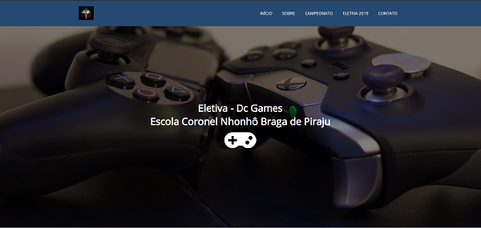
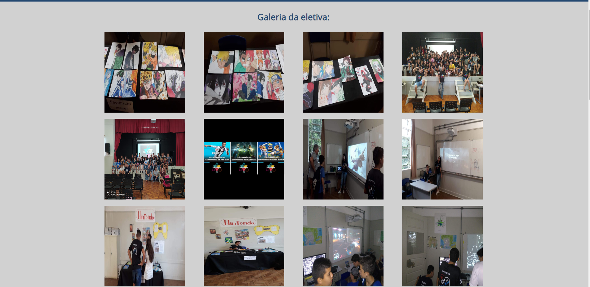

# Site Dc Games  

Dc Games é uma disciplina eletiva da escola Coronel Nhonhô Braga que tem o intuito de levar o conhecimento através dos games.

Primeiro projeto realizado e aplicado com sucesso, ele já estava em desenvolvimento antes mesmo de eu aprender o github e foi atualizado várias vezes até chegar neste estado.
O site tem o propósito de divulgar a eletiva Dc Games, mostrando qual foi o intuito da eletiva, quais pessoas estavam participando, eventos, etc...

Foi desenvolvido somente no Front-End com as tecnologias: HTML5, CSS3 e Javascript puro.

### Imagens do Site:

