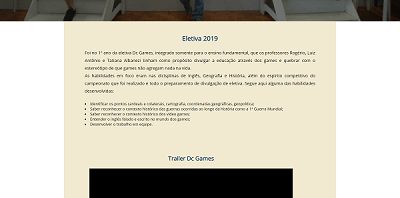

# Website [Dc Games](https://gabrielwolf-dev.github.io/Dc-Games/)

## Demonstração do site:

## Sobre o Projeto:

Dc Games é uma disciplina eletiva da escola Coronel Nhonhô Braga que tem o intuito de levar o conhecimento através dos games.

Foi o meu primeiro projeto realizado e aplicado com sucesso, ele já estava em desenvolvimento antes mesmo de eu aprender o github e foi atualizado várias vezes até chegar neste estado.

A partir da data 15/05/2021, vou atualizar todo o código do Website Dc Games para padronizar o CSS com o BEM, construir um HTML mais semântico com o foco na acessibilidade do site e refatorar alguns scripts.

## Solução do problema:

O site tem o propósito de divulgar a eletiva Dc Games, mostrando qual foi o intuito da eletiva, quais pessoas estavam participando, eventos, etc...

## Experiência final:

Eu ganhei muito conhecimento no HTML5, CSS3 e Javascript graças a este projeto que me deu mais um motivo para estudar cada vez mais a Programação e aplicar o que eu estava estudando. Foi por conta deste projeto que decidi me especializar na área Front-End que é a stack mais interessante para mim e depois expandir o meu conhecimento nas outras stacks.

## Foi desenvolvido somente no Front-End com as tecnologias:
* HTML5;
* CSS3;
* Javascript.

### Desafios:
- [x] Definir uma paleta de cores e escolher um layout para o site;
- [x] Inserir o conteúdo usando o HTML5;
- [x] Estilizar todo o conteúdo da página com o CSS3;
- [x] Deixar o website responsivo com o CSS3;
- [x] Menu mobile(Javascript);
- [x] Modal(Javascript);
- [x] Slider(Javascript);
- [x] Inserir meta tags para SEO;
- [x] Inserir um ícone.

### Imagens do Site:

